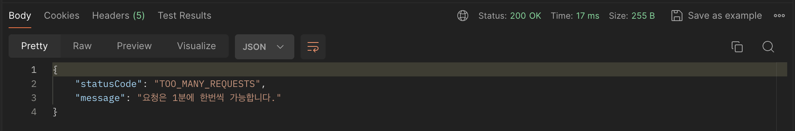

# redis-apps

redis-applications with SprignBoot

### Install && Run Server(MAC)

- brew install redis
- brew services start redis
- brew services stop redis
- brew services restart redis

### Spring Settings

```
implementation 'org.springframework.boot:spring-boot-starter-data-redis'
```

### OTP

- 일회용 비밀번호(이메일 등 인증에 사용)
- 인증 요청을 하면 redis에 인증정보(email), 인증코드(랜덤 생성) 저장
- 인증 확인을 할 때 다시 가져와서 비교
- 일정시간(3m) 이후 자동으로 만료되게 하고 인증이 성공한 후에도 삭제 처리
- [ ] 현재 코드를 그냥 보이게 해놨는데 나중에 메일서비스 만들면 수정

### Distribution Lock

- 두개의 스레드가 동시에 같은 자원에 접근할 경우 동시성 문제 발생
- 먼저 실행된 스레드가 작업을 처리할 때 까지 대기 후 실행
- redis에 실행 중인지 확인하는 키를 생성 후 존재하지 않으면 스레드의 작업을 실행


### Rate Limit

- 서버의 안정성/보안을 위해 연속된 요청을 제한
- 서버에 이미 키가 존재하는지 간단하게 확인
  
  
